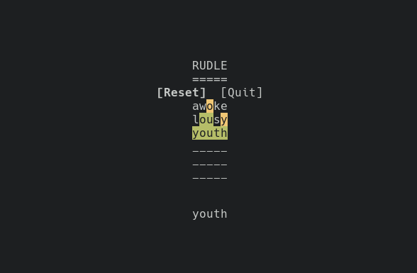

# Rudle

## About
This is a simple [Wordle](https://www.nytimes.com/games/wordle/index.html)
clone for a terminal. It was written in [Rust](https://www.rust-lang.org/) with
the [ncurses Rust bindings](https://docs.rs/ncurses/5.99.0/ncurses/) to help me
learn both, and for my own amusement.

## Dependencies
* [ncurses](https://invisible-island.net/ncurses/)
* [cargo](https://doc.rust-lang.org/cargo/) - for building

## Building
1. `git clone git@github.com:nbockisch/rudle.git && cd rudle`
2. `cargo build --release`
3. The binary will be called `rudle` and can be found in `/target/release/`

## To Do
At some point I might clean up and optimize the code more, since I put this
together pretty quickly. I might update the guess checker to account for letter
frequency in the solution like in the original game.
